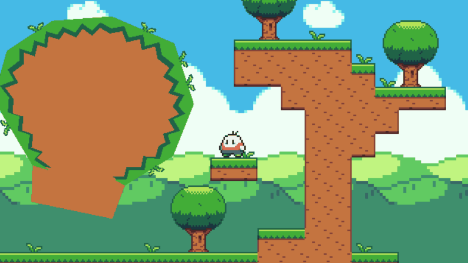

# JogoPlataforma-Godot-3.4.4

Exemplo de jogo de plataforma na Godot 3.4.4

A proposta é explorar o potencial da Godot criando o mínimo possível de scripts.

## 2D Kinematic Character Demo

Example of how to make a kinematic character controller in 2D using KinematicBody2D. The character moves around, is affected by moving platforms, can jump through one-way collision platforms, etc.

Script de movimentação criado a partir deste exemplo.

https://godotengine.org/asset-library/asset/113

## Tutorial Godot by  Papai Game Maker

O projeto foi construído seguindo estes vídeos do youtube. Mas alumas coisas precisaram ser modificadas pois estou trabalhando com a a Gogot 3.4.4

https://www.youtube.com/watch?v=v1M3hgVIQDs&list=PLQzIfDE4WrykZYdgJedkgH-f4BVVdVVr6

## Arcade Platformer Assets by GrafxKid

A collection of sprites designed primarily for an arcade-style platformer game. Includes 1 player character, 8 types of enemies, and other stuff like coins and scenery.

Copyright/Attribution Notice: Credit me as GrafxKid.

https://opengameart.org/content/arcade-platformer-assets
